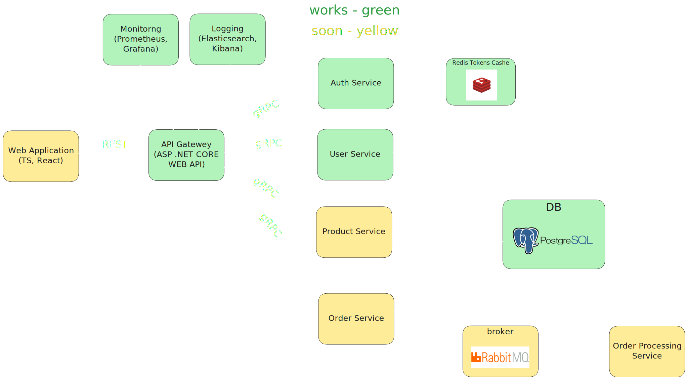

<a id="readme-top"></a>

<br />
<div align="center">

  <h1 align="center">Commerce Flow</h1>
  
  <h3 align="center">A Simple E-commerce Backend with ASP.NET Core and Microservices</h3>

</div>


<!-- ABOUT THE PROJECT -->
## About The Project

CommerceFlow is a simple and modular e-commerce system built using ASP.NET Core and microservices. The project includes user authentication and authorization, as well as actions with products and orders. The development utilizes technologies such as ASP.NET Core, gRPC, Entity Framework Core, Docker, Redis, and RabbitMQ.

- <strong>The project is still in its early stages, so the code will continue to be improved and refactored over time.</strong>


### Built With

[](https://skillicons.dev)

</p>


<!-- GETTING STARTED -->
## Getting Started

### Default running

The entire project runs through Docker, so all you need to do is:

1. Clone the project to your computer using the command:
   ```sh
   git clone https://github.com/correntis/CommerceFlow.git
   ```
2. Navigate to the project directory:
   ```sh
   cd CommerceFlow
   ```
3. Open a terminal in the project folder and Build the services using Docker:
   ```sh
   docker-compose up --build
   ```
4. Once the project is running, you can access the Swagger UI by navigating to the link
   ```
   http://localhost:5000/swagger/index.html
   ```

### Running with metrics

To running application using Prometheus and Grafana, follow these steps:

1. Use the following command to build and run the services with metrics enabled:
   ```
   docker-compose -f docker-compose-metrics.yaml up --build
   ```
2. Access the Grafana dashboard by navigating to:
   ```
   http://localhost:3000
   ```
3. Log in to Grafana with the default credentials:
   ```
   Username: admin
   Password: admin
   ```
4. Create a dashboard based on the default data source "prometheus".


<p align="right">(<a href="#readme-top">back to top</a>)</p>


[React.js]: https://img.shields.io/badge/React-20232A?style=for-the-badge&logo=docker&logoColor=61DAFB